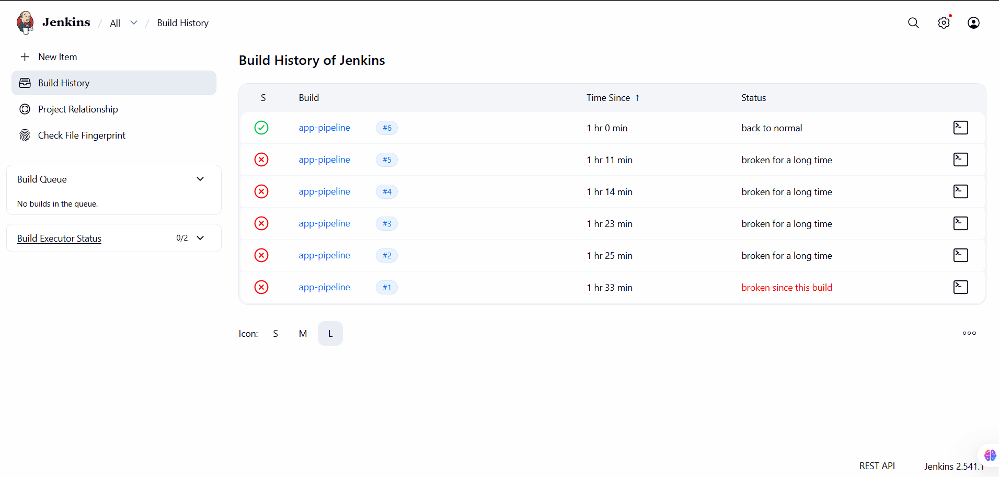
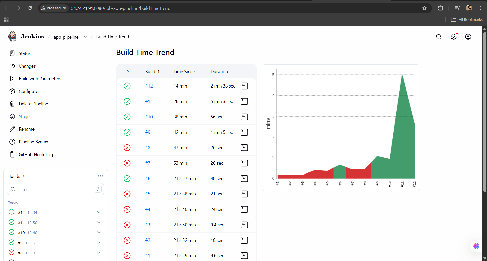
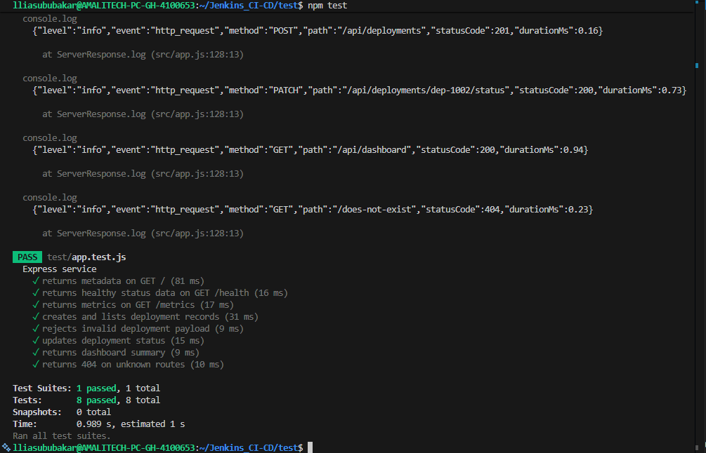
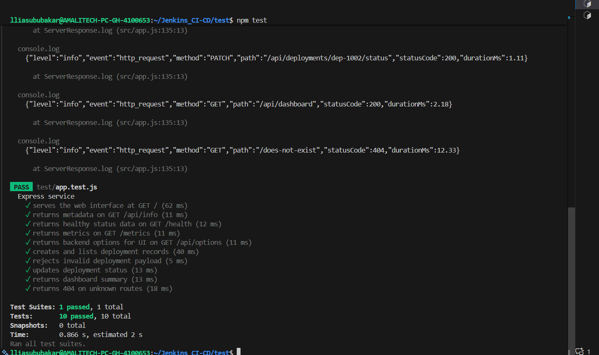

# Agile & DevOps Submission

**Project:** DevOps Release Tracker  
**Date:** February 2026  
**Repository:** [github.com/nabbi007/Jenkins-CI-CD](https://github.com/nabbi007/Jenkins-CI-CD)  
**Live App:** http://54.74.21.91:80

---

## Grading Compliance

| Dimension | Weight | Evidence |
|-----------|--------|----------|
| Agile Practice | 25% | Backlog (8 stories), Acceptance Criteria, Sprint Plans |
| DevOps Practice | 25% | Jenkins Pipeline (7 stages), 10 Tests, Monitoring |
| Delivery Discipline | 20% | 65 incremental commits, Feature branches |
| Prototype Quality | 20% | Live app at 54.74.21.91, 10/10 tests passing |
| Reflection | 10% | Retrospectives with improvements applied |

---

## Product Vision

**DevOps Release Tracker** — A web application for tracking deployments, managing release state, and monitoring health in CI/CD pipelines.

**Target Users:** DevOps engineers, release managers, platform teams

---

## Branching Strategy

The project uses a coordinated branching strategy:

```
main                          ← Production-ready code
├── sprint-0/planning         ← Sprint 0: Backlog & setup
├── sprint-1/execution        ← Sprint 1: Core delivery
├── sprint-2/execution        ← Sprint 2: Advanced features
│
├── feature/us01-express-foundation    ← US-01 work
├── feature/us02-tests                 ← US-02 work
├── feature/us03-dockerize-service     ← US-03 work
├── feature/us04-jenkins-pipeline      ← US-04 work
├── feature/us05-us07-delivery-hardening ← US-05, US-07 work
└── feature/us06-observability         ← US-06 work
```

**Flow:** Feature branches → Sprint branch → Main

---

## Product Backlog

| ID | User Story | Points | Priority |
|----|------------|--------|----------|
| US-01 | Express API Foundation | 3 | 8 (Must) |
| US-02 | Automated Testing | 5 | 8 (Must) |
| US-03 | Docker Containerization | 3 | 8 (Must) |
| US-04 | Jenkins CI/CD Pipeline | 8 | 8 (Must) |
| US-05 | EC2 Deployment | 5 | 5 (Should) |
| US-06 | Logging & Monitoring | 3 | 3 (Could) |
| US-07 | Web UI Dashboard | 5 | 3 (Could) |
| US-08 | Verification Scripts | 3 | 2 (Nice) |

**Total:** 35 Story Points  
**Priority Scale:** Fibonacci (1, 2, 3, 5, 8, 13)

---

## User Stories

### US-01: Express API Foundation
**As a** developer  
**I want** a minimal Express service  
**So that** I have a deployable web API

| Points | Priority | Sprint |
|--------|----------|--------|
| 3 | 8 | Sprint 1 |

**Acceptance Criteria:**
- [ ] GET / returns 200 with JSON metadata
- [ ] Service listens on PORT (default 3000)
- [ ] App starts with `npm start`
- [ ] Health endpoint returns status

---

### US-02: Automated Testing
**As a** developer  
**I want** unit and integration tests  
**So that** regressions are caught early

| Points | Priority | Sprint |
|--------|----------|--------|
| 5 | 8 | Sprint 1 |

**Acceptance Criteria:**
- [ ] `npm test` runs Jest suite
- [ ] Minimum 8 test cases
- [ ] Tests exit non-zero on failure
- [ ] Tests run automatically in CI

---

### US-03: Docker Containerization
**As a** DevOps engineer  
**I want** Docker image builds  
**So that** deployments are consistent

| Points | Priority | Sprint |
|--------|----------|--------|
| 3 | 8 | Sprint 1 |

**Acceptance Criteria:**
- [ ] Dockerfile exists
- [ ] `docker build` succeeds
- [ ] Container exposes app port
- [ ] Alpine base for small image

---

### US-04: Jenkins CI/CD Pipeline
**As a** DevOps engineer  
**I want** an automated pipeline  
**So that** delivery is reproducible

| Points | Priority | Sprint |
|--------|----------|--------|
| 8 | 8 | Sprint 1 |

**Acceptance Criteria:**
- [ ] Jenkinsfile with 7 stages
- [ ] Pipeline stops on failure
- [ ] AWS credentials from Jenkins store
- [ ] Docker agent for Node stages
- [ ] Health checks after deploy

---

### US-05: EC2 Deployment
**As an** operator  
**I want** automated EC2 deployment  
**So that** users access latest releases

| Points | Priority | Sprint |
|--------|----------|--------|
| 5 | 5 | Sprint 1 |

**Acceptance Criteria:**
- [ ] Pipeline deploys via SSH
- [ ] Old containers cleaned up
- [ ] Health check verifies app
- [ ] Public IP accessible
- [ ] URL printed in output

---

### US-06: Logging & Monitoring
**As an** operator  
**I want** structured logging  
**So that** issues are visible

| Points | Priority | Sprint |
|--------|----------|--------|
| 3 | 3 | Sprint 2 |

**Acceptance Criteria:**
- [ ] Logs include method, path, status
- [ ] GET /health returns uptime
- [ ] GET /metrics returns counters
- [ ] JSON format for parsing

---

### US-07: Web UI Dashboard
**As a** user  
**I want** a web interface  
**So that** I can manage deployments visually

| Points | Priority | Sprint |
|--------|----------|--------|
| 5 | 3 | Sprint 2 |

**Acceptance Criteria:**
- [ ] UI at root path (/)
- [ ] Dashboard shows summary
- [ ] Deployment list with status
- [ ] Create/update forms
- [ ] Responsive design

---

### US-08: Verification Scripts
**As a** developer  
**I want** local verification  
**So that** regressions are caught pre-push

| Points | Priority | Sprint |
|--------|----------|--------|
| 3 | 2 | Sprint 2 |

**Acceptance Criteria:**
- [ ] `npm run verify:local` runs workflow
- [ ] Includes install, test, build, smoke
- [ ] Exits non-zero on failure
- [ ] Works in CI and local

---

## Definition of Done

1. ✅ Code committed with clear message
2. ✅ Feature branch merged to sprint branch
3. ✅ All acceptance criteria met
4. ✅ Tests pass (local + CI)
5. ✅ Documentation updated
6. ✅ Pipeline runs successfully
7. ✅ Sprint branch merged to main

---

## Sprint Execution

### Sprint 0: Planning (Feb 3-7)

**Goal:** Define backlog, setup environment, plan sprints

**Output:**
- Product backlog with 8 user stories
- Acceptance criteria for all stories
- Definition of Done established
- Branch structure created
- Sprint 1 planned and committed

**Branch:** `sprint-0/planning`

**Improvements Identified → Applied in Sprint 1:**
- Need Docker agent for npm commands
- Need AWS session token for ECR
- Need health check verification

---

### Sprint 1: Core Delivery (Feb 10-14)

**Goal:** Deliver working API with CI/CD pipeline

| Story | Points | Branch |
|-------|--------|--------|
| US-01 | 3 | feature/us01-express-foundation |
| US-02 | 5 | feature/us02-tests |
| US-03 | 3 | feature/us03-dockerize-service |
| US-04 | 8 | feature/us04-jenkins-pipeline |
| US-05 | 5 | feature/us05-us07-delivery-hardening |

**Capacity:** 24 SP  
**Delivered:** 24 SP (100%)

**Branch:** `sprint-1/execution`

**Coordination:**
- Feature branches created from sprint branch
- Each story worked in isolation
- Merged to sprint branch on completion
- Sprint branch merged to main at sprint end

**Improvements Applied (from Sprint 0):**
- ✅ Added Docker agent `node:18-alpine`
- ✅ Configured AWS session token credential
- ✅ Integrated health check in deploy stage

**Improvements Identified → Applied in Sprint 2:**
- UI routing should be at root path
- Public directory missing in Docker
- Asset paths need correction

---

### Sprint 2: Advanced Features (Feb 15-17)

**Goal:** Deliver UI, monitoring, and polish

| Story | Points | Branch |
|-------|--------|--------|
| US-06 | 3 | feature/us06-observability |
| US-07 | 5 | feature/us05-us07-delivery-hardening |
| US-08 | 3 | (inline work) |

**Capacity:** 20 SP  
**Committed:** 11 SP  
**Delivered:** 11 SP (100%)

**Branch:** `sprint-2/execution`

**Improvements Applied (from Sprint 1):**
- ✅ Refactored UI to serve at root path (/)
- ✅ Added `COPY public ./public` to Dockerfile
- ✅ Fixed asset paths in HTML

---

## CI/CD Pipeline

**7 Stages:**

```
1. Checkout        → Clone repository
2. Install/Build   → npm ci (Docker agent)
3. Test            → npm test (10 cases)
4. Resolve ECR     → AWS credential check
5. Docker Build    → Build image
6. Push to ECR     → Push to registry
7. Deploy          → SSH to EC2 + health check
```

**Screenshots:**

**Sprint 1 — First Successful Pipeline Run:**



**Sprint 2 — Final Pipeline (All 7 Stages Passing):**



---

## Test Evidence

**10 Test Cases (100% pass):**

| # | Test | Endpoint |
|---|------|----------|
| 1 | UI serves HTML | GET / |
| 2 | Health check | GET /health |
| 3 | Metrics endpoint | GET /metrics |
| 4 | API info | GET /api/info |
| 5 | Options endpoint | GET /api/options |
| 6 | List deployments | GET /api/deployments |
| 7 | Create deployment | POST /api/deployments |
| 8 | Update status | PATCH /api/deployments/:id |
| 9 | Dashboard | GET /api/dashboard |
| 10 | 404 handling | GET /unknown |

**Screenshots:**

**Sprint 1 — Initial Test Suite (8 Tests Passing):**



**Sprint 2 — Final Test Suite (10 Tests Passing):**



---

## Commit History

```bash
$ git rev-list --count HEAD
65 commits
```

**Pattern:** Incremental commits per feature

```
feat(api): add health check endpoint
fix(pipeline): add Docker agent
test(app): add 10 test cases
docs(backlog): add user stories
refactor(routing): serve UI at root
ci(jenkins): add AWS session token
```

---

## Retrospectives

### Sprint 1 → Sprint 2 Improvements

| Challenge | Root Cause | Improvement Applied |
|-----------|------------|---------------------|
| npm EACCES error | Cache in root dir | Added NPM_CONFIG_CACHE |
| Docker agent unavailable | Wrong image | Switched to node:18-alpine |
| UI at /ui path | Initial design | Refactored to root path |

### Sprint 2 Lessons

| Challenge | Root Cause | Solution |
|-----------|------------|----------|
| CSS/JS not loading | Missing public dir | Added COPY to Dockerfile |
| Asset 404 errors | Wrong paths in HTML | Fixed href/src paths |
| Health check slow | Network latency | Added retry loop |

---

## Project Structure

```
Jenkins_CI-CD/
├── SUBMISSION.md        ← This document
├── Jenkinsfile          ← 7-stage pipeline
├── Dockerfile           ← Container config
├── src/app.js           ← Express API
├── test/app.test.js     ← 10 Jest tests
├── public/              ← Web UI
└── docs/                ← Sprint artifacts
```

---

## Evidence Links

| Artifact | Location |
|----------|----------|
| Backlog | [docs/PLANNING.md](docs/PLANNING.md) |
| Sprint 1 | [docs/SPRINT1_PLAN.md](docs/SPRINT1_PLAN.md) |
| Sprint 2 | [docs/SPRINT2_PLAN.md](docs/SPRINT2_PLAN.md) |
| Pipeline | [Jenkinsfile](Jenkinsfile) |
| Tests | [test/app.test.js](test/app.test.js) |
| Reviews | [docs/REVIEWS.md](docs/REVIEWS.md) |
| Retrospectives | [docs/RETROSPECTIVES.md](docs/RETROSPECTIVES.md) |

---

## Checklist

- [x] Backlog: 8 prioritized stories
- [x] Acceptance criteria: ALL stories
- [x] Sprint plans: Aligned with backlog
- [x] Branches: Feature → Sprint → Main
- [x] Pipeline: 7 stages working
- [x] Tests: 10/10 passing
- [x] Commits: 65 incremental
- [x] Prototype: Live and working
- [x] Retrospectives: Improvements applied
